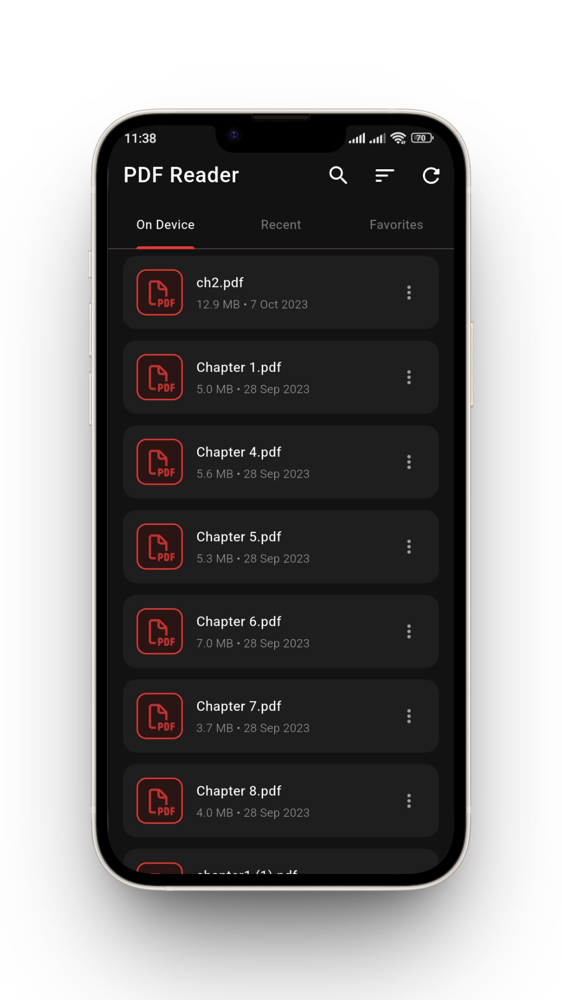
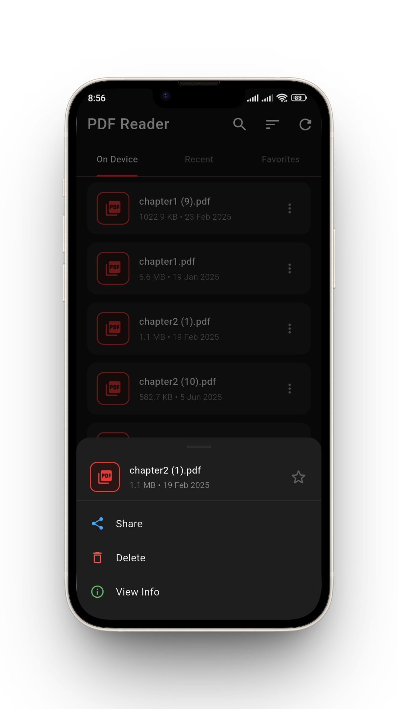
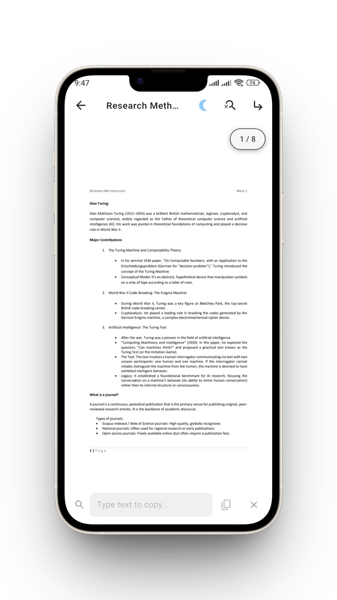
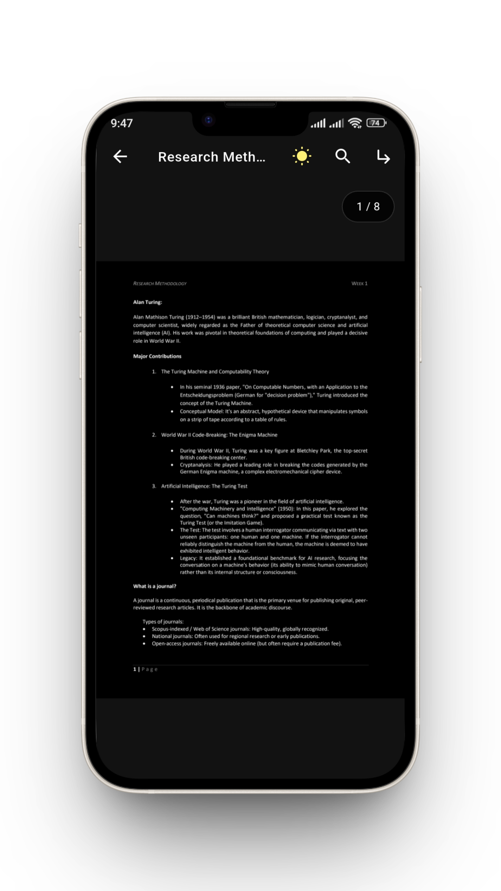
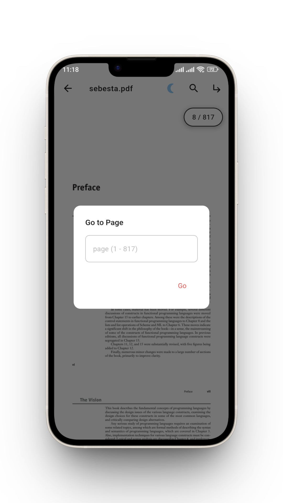
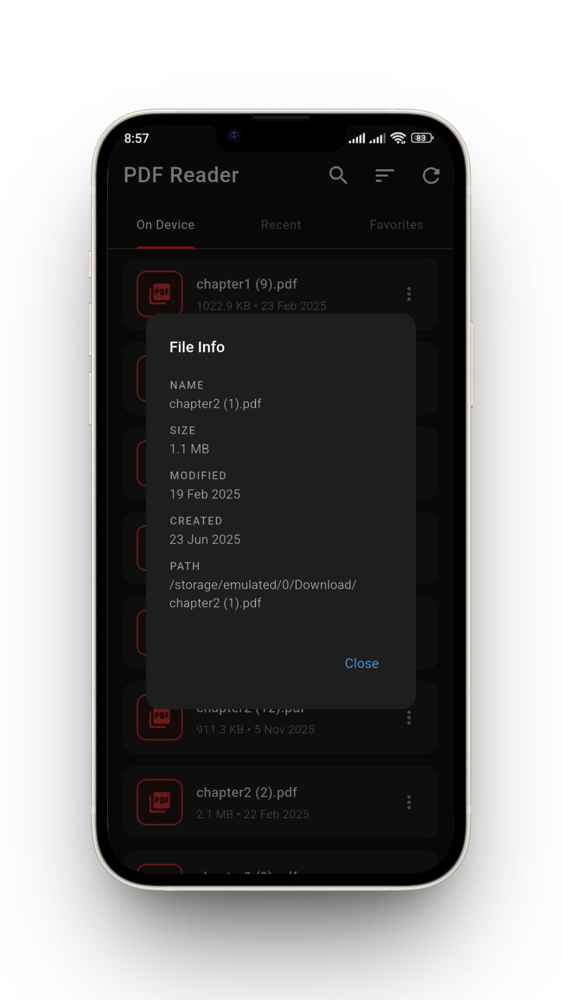
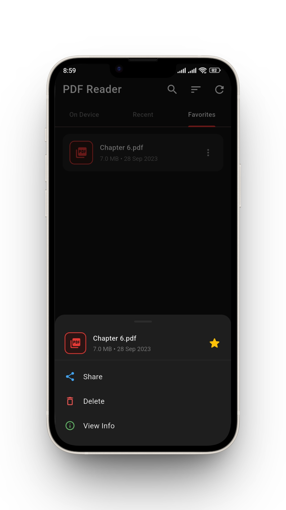
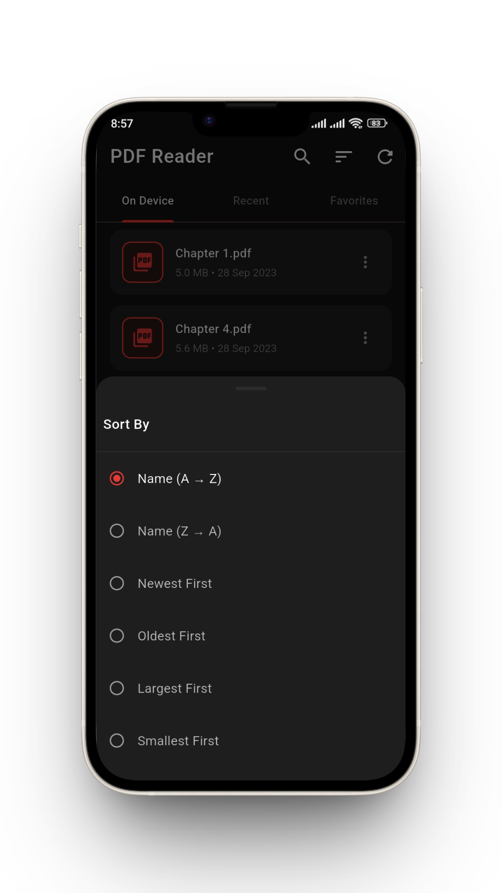

# PDF Reader

A modern, dark-themed PDF reader app built with Flutter.
Designed exclusively for **Android** and **iOS** devices.
Browse, organise, and read all PDF files stored on your device.

> [!IMPORTANT]
> This application has currently only been tested on **Android**. Support for **iOS** is implemented according to documentation but has not been verified on physical or simulated iOS devices.

---


---

## 📸 Screenshots

| PDF List | PDF Options |
| :---: | :---: |
|  |  |

| Light Mode Viewer | Dark Mode Viewer |
| :---: | :---: |
|  |  |

| Jump to Page | File Information |
| :---: | :---: |
|  |  |

| Favorites Tab | Sort Options |
| :---: | :---: |
|  |  |

---

## 🛠️ Core Technologies

- **State Management**: [Provider](https://pub.dev/packages/provider) for clean and efficient state handling.
- **Local Storage**: [Shared Preferences](https://pub.dev/packages/shared_preferences) for persistent storage of favourites, recents, and file cache.

---

## ✨ Features

| Feature | Description |
| --- | --- |
| 📁 **Auto PDF Discovery** | Scans your entire device storage for PDF files on first launch |
| ⚡ **Instant Reopen** | After first scan, loads instantly from local cache — no rescan on every open |
| ⭐ **Favourites** | Star any PDF; persists across app restarts |
| 🕐 **Recent Files** | Tracks last-opened time; survives app close |
| 🌙 **Night / Day Mode** | Toggle inside the PDF viewer per document |
| 📊 **Sort Options** | Sort by Name, Date, or File Size (ascending/descending) |
| 🔍 **Search** | Filter PDFs by filename instantly |
| � **Text Copy Bar** | Bottom sliding bar allows typing and copying text while viewing |
| 🛡️ **SafeArea UI** | Enhanced layout with `SafeArea` for modern notched devices |
| �🗑️ **Delete** | Remove PDFs from device with confirmation |
| 📤 **Share** | Share any PDF via the OS share sheet |
| ℹ️ **File Info** | View path, size, and dates |
| 📖 **Vertical Scroll** | Pages scroll naturally top-to-bottom with snap |
| 🔢 **Page Indicator** | Floating overlay showing current/total pages; tap to jump |
| 📂 **Open With** | Appears in Android "Open With" when tapping any `.pdf` file |
| 🔄 **Manual Refresh** | Rescan device for newly added PDFs via refresh button |

---

## 🗂️ Project Structure

```text
lib/
├── core/
│   └── app_theme.dart               # All colours, text styles, dimensions
├── data/
│   ├── models/
│   │   ├── pdf_file_model.dart      # Data model with JSON serialisation
│   │   └── sort_option.dart         # Sort enum + display labels
│   └── repositories/
│       ├── pdf_repository.dart      # Device file scanning & deletion
│       └── pdf_storage_service.dart # SharedPreferences persistence layer
├── logic/
│   └── controllers/
│       └── pdf_library_controller.dart  # All business logic + PdfViewerController
├── ui/
│   ├── screens/
│   │   ├── home_screen.dart         # 3-tab main screen with sort & search
│   │   └── pdf_viewer_screen.dart   # Full-screen reader with night mode
│   └── widgets/
│       ├── pdf_card.dart            # Custom card (no ListTile)
│       ├── pdf_list_tab.dart        # Reusable tab body + dialogs
│       └── pdf_options_modal.dart   # Bottom sheet with actions
└── main.dart                        # App entry + "Open With" intent handling
```

---

## 📦 Dependencies

| Package | Purpose |
| --- | --- |
| `flutter_pdfview` | Render PDF files natively |
| `provider` | State management (Provider) |
| `shared_preferences` | Local persistence (Shared Preferences - favourites, recents, file cache) |
| `permission_handler` | Runtime storage permissions |
| `external_path` | Get external storage path on Android |
| `share_plus` | OS share sheet |
| `receive_sharing_intent` | Handle "Open With" from file manager |
| `path_provider` | Standard directory access (required for iOS) |
| `font_awesome_flutter` | Stylized icons for PDF cards |
| `flutter_launcher_icons` | App icon generation |
| `path` | File path utilities |

---

## Architecture

Clean separation of concerns across three layers:

```text

Data Layer          →  Models + Repositories
Logic Layer         →  Controllers (ChangeNotifier / Provider)
UI Layer            →  Screens + Widgets
```

**No business logic in UI files.**
**No hardcoded colours or strings in widgets** — everything references `app_theme.dart`.

### Local Storage Strategy

```text
First launch   →  Scan device  →  Save to SharedPreferences
Every reopen   →  Load from SharedPreferences  (instant, no scan)
New PDFs added →  Tap ↻ Refresh  →  Rescan + merge saved state
Star a PDF     →  Update SharedPreferences immediately
Open a PDF     →  Save lastOpened timestamp immediately
```

---

## 🚀 Getting Started

### Prerequisites

- Flutter SDK `>=3.0.0`
- Dart SDK `>=3.0.0`
- Android SDK (minSdkVersion 21) or Xcode for iOS

### Installation

```bash
# 1. Clone the repo
git clone https://github.com/YOUR_USERNAME/pdf_library.git
cd pdf_library

# 2. Install dependencies
flutter pub get

# 3. Run on your device
flutter run
```

---

## ⚙️ Android Setup

### 1. AndroidManifest.xml

Replace `android/app/src/main/AndroidManifest.xml` with the content
from `docs/AndroidManifest.xml` in this repo.

Key permissions added:

```xml
<uses-permission android:name="android.permission.READ_EXTERNAL_STORAGE"
    android:maxSdkVersion="32"/>
<uses-permission android:name="android.permission.WRITE_EXTERNAL_STORAGE"
    android:maxSdkVersion="29"/>
<uses-permission android:name="android.permission.MANAGE_EXTERNAL_STORAGE"/>
```

Intent filters for "Open With":

```xml
<!-- file:// scheme (MIUI File Manager) -->
<intent-filter android:priority="1">
    <action android:name="android.intent.action.VIEW"/>
    <category android:name="android.intent.category.DEFAULT"/>
    <data android:scheme="file" android:mimeType="application/pdf"/>
</intent-filter>

<!-- content:// scheme (Android 7+, Downloads, Gmail, WhatsApp) -->
<intent-filter android:priority="1">
    <action android:name="android.intent.action.VIEW"/>
    <category android:name="android.intent.category.DEFAULT"/>
    <data android:scheme="content" android:mimeType="application/pdf"/>
</intent-filter>
```

### 2. file_paths.xml

Create `android/app/src/main/res/xml/file_paths.xml`:

```xml
<?xml version="1.0" encoding="utf-8"?>
<paths>
    <external-path name="external_files" path="."/>
    <files-path name="files" path="."/>
    <cache-path name="cache" path="."/>
</paths>
```

### 3. build.gradle

```gradle
android {
    defaultConfig {
        minSdkVersion 21
        targetSdkVersion 34
    }
}
```

---

## iOS Setup

Add to `ios/Runner/Info.plist` inside the main `<dict>`:

```xml
<key>CFBundleDocumentTypes</key>
<array>
    <dict>
        <key>CFBundleTypeName</key>
        <string>PDF Document</string>
        <key>CFBundleTypeRole</key>
        <string>Viewer</string>
        <key>LSHandlerRank</key>
        <string>Alternate</string>
        <key>LSItemContentTypes</key>
        <array>
            <string>com.adobe.pdf</string>
        </array>
    </dict>
</array>
<key>NSDocumentsFolderUsageDescription</key>
<string>PDF Library needs access to your documents to find PDF files.</string>
```

### iOS Restrictions (Sandboxing)

> [!IMPORTANT]
> iOS employs a strict **App Sandboxing** model that differs significantly from Android.
>
> 1. **Limited File Discovery**: The app cannot scan the entire device storage (e.g., Downloads, WhatsApp folders).
> 2. **Documents Folder**: Only files placed in the app's local **Documents** folder (visible in the iOS Files app under "On My iPhone/iPad > PDF Library") will be automatically discovered.
> 3. **Open In / Share**: To view PDFs from other apps (like Safari or Mail), use the **"Open In..."** menu and select **PDF Library**.
> [!WARNING]
> Please note that the iOS version of this app has **not** been tested. Testing has been performed exclusively on Android.

---

## 🤝 Contributing

Pull requests are welcome. For major changes, open an issue first.

---
